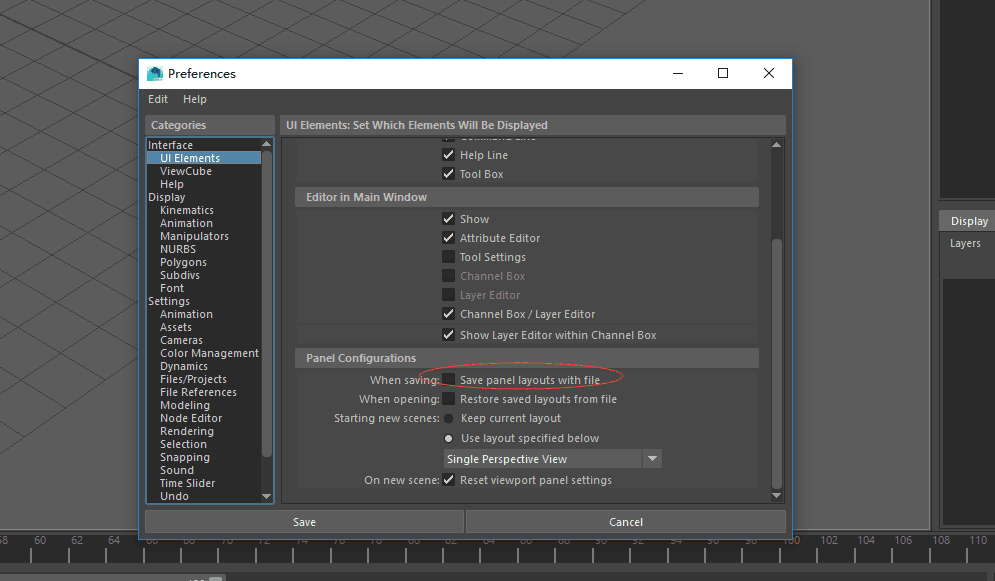

# 插件使用

> 以下都是一些曾经遇到过的bug，原因不详，但可以通过一些方法避免bug产生或传播

## 界面设置bug

由于不知名插件的原因，会导致maya的界面窗口出现bug，如果你不幸打开了该文件A，直接保存或直接打开另一个文件B，那这个bug就会在文件A和文件B里，一直传到之后的流程中，途中还可能传给其他文件CDEFG……

所以，推荐以下操作避免bug的传播

* 务必养成习惯，在新开maya的状态下打开一个新文件，而不是在打开旧文件的状态下，直接打开一个新文件
* 在preference设置里，关闭勾选save panel layouts with file。这样你每次保存文件时，都不会保存你的maya窗口界面设置，所以即使你打开是由界面bug，但保存时并不会把这个bug保存下来。

