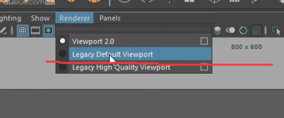

# 场景优化

## 参考maya帮助文档

[Maya2016帮助-优化场景播放](http://help.autodesk.com/view/MAYAUL/2016/CHS/?guid=GUID-6002180E-1171-4FF2-8E2B-4C208F5DB2CC)

## 选择合适的即时渲染模式

一般选 viewport2.0 或 legacy default viewport，哪个不卡用哪个吧~




## 关闭毛发预览

运行以下 mel命令 关闭毛发即时预览

```text
xgmPreview -c
```

## 将模型调为低圆滑显示模式

全选模型按“1”，将模型调为低顺滑显示模式，减轻场景负担

## 硬件提升

可以去找定俊申请一下，祝你好运吧~


