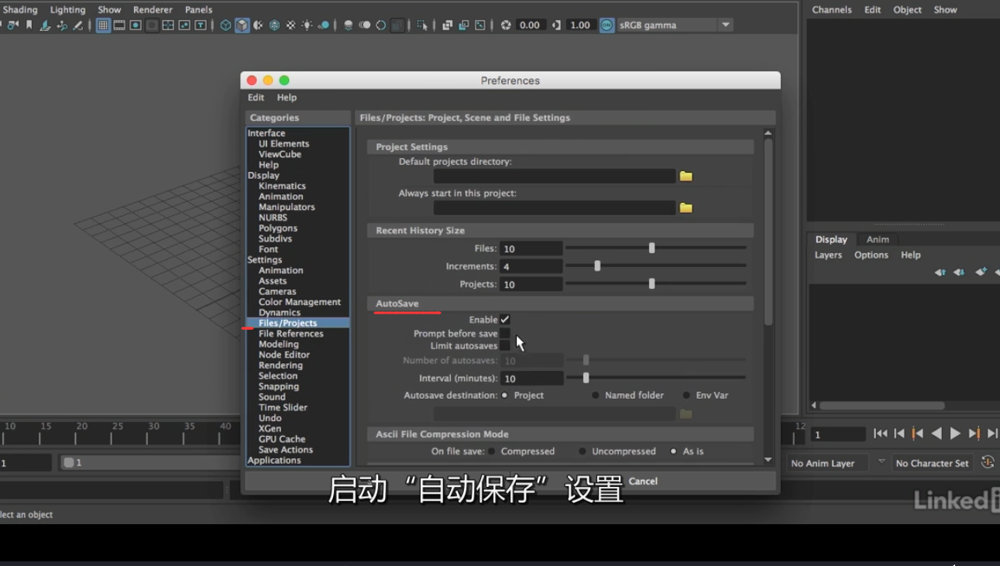
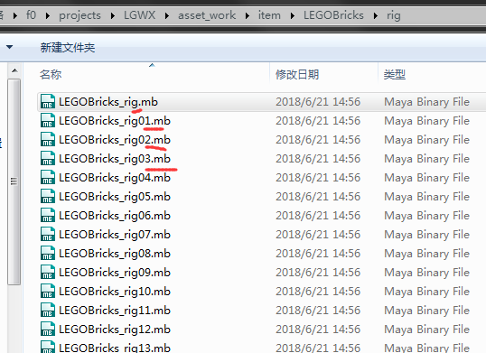
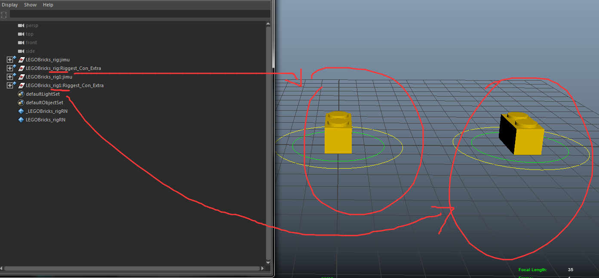
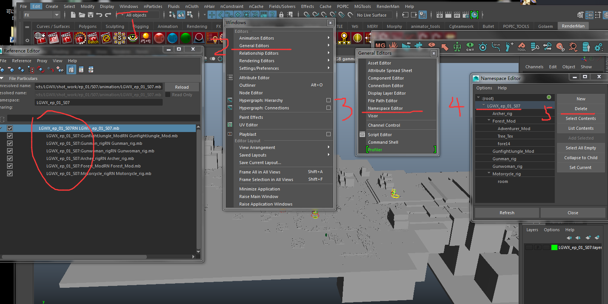
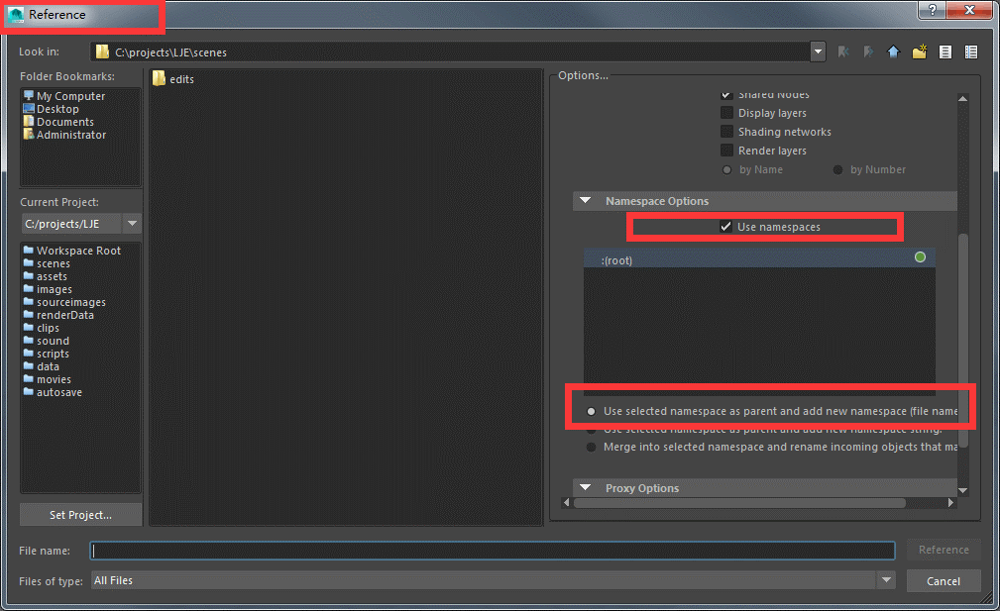

# 工程文件操作

## 做好文件备份工作！！！

1、打开自动保存设置，预防突发情况（比如maya突然崩溃、公司突然断电）

2、在CGTeamwork和本地电脑都做好备份

> 在CGteamwork上，一般在工程文件对应的文件夹目录下，新建一个“history”文件夹，在里面放置备份文件即可。

## 不要同时引用同一个绑定文件

在同一个场景文件下，如果你要同时引用同一个绑定文件A1，那请将A1复制多一份为A2，再分别引用A1和A2。

> 这样可以避免前缀重名的情况，在后面的渲染才不会对应不上相应的文件。

比如你需要在你的场景里引用多个积木，但只有一个积木文件A，那你需要把文件A复制为A1、A2、A3……，然后分别引用A、A1、A2、A3……

## 删除引用文件的多余前缀

二次引用转import后、或一次引用时，文件名前有时会有多余的前缀，可以在namspace edits 窗口里删除掉 。如果有弹出窗口，一般选择“merge with root”选项，确保最后只留下 root 层级的前缀

> 如果有多余前缀，后期渲染时会出现名称不对应，导致出错~

## 引用文件时务必将前缀也引用上

引用时确保勾选namespaces选项，这样不会出现前缀名丢失的情况

## 检查文件里的动画是否干净

开始正式动画作业前，都请务必检查文件里的动画数据是否是**干净的**、**正确的**。在制作的过程中，也要这种随时检查的情况。

> 在前期layout中会残留一些错误的K动画信息，比如直接给模型K了动画
>
> 绑定组在制作绑定时，有时也会给文件K动画而忘记删除了
>
> 所以，在拿到这些旧layout文件或新的绑定文件时，都请检查清楚

