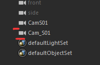
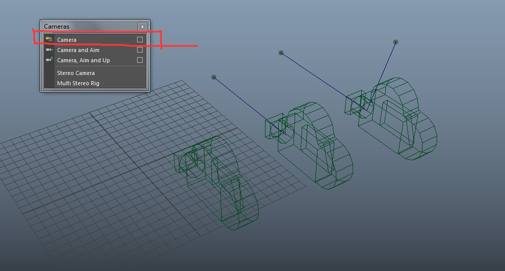
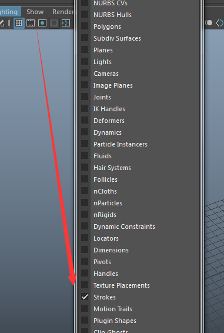
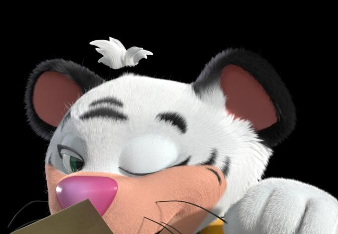
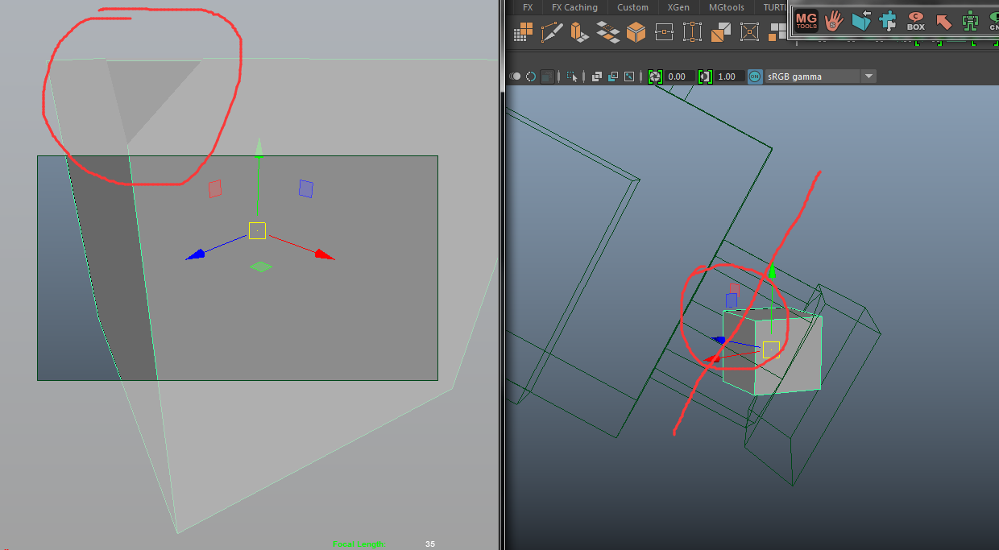
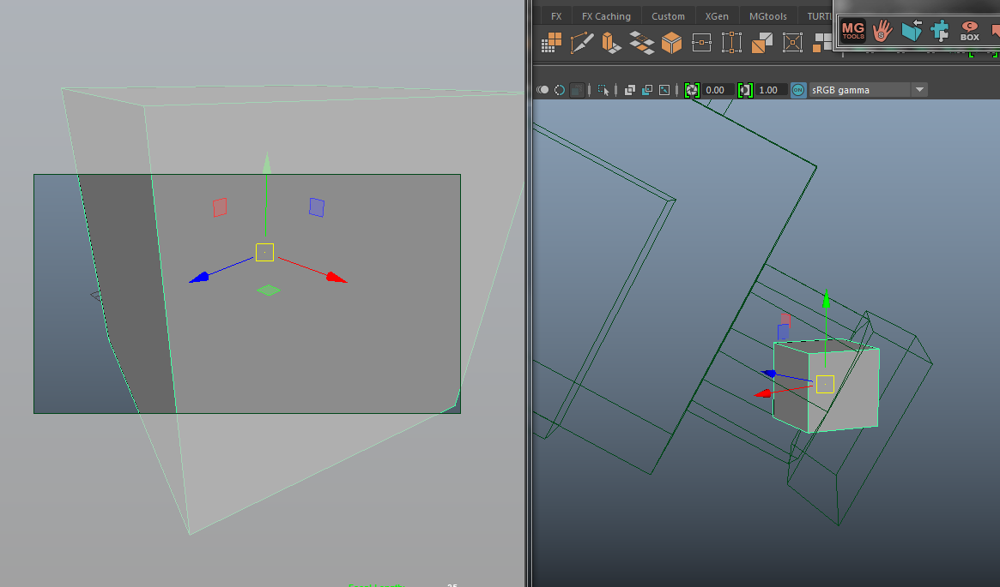
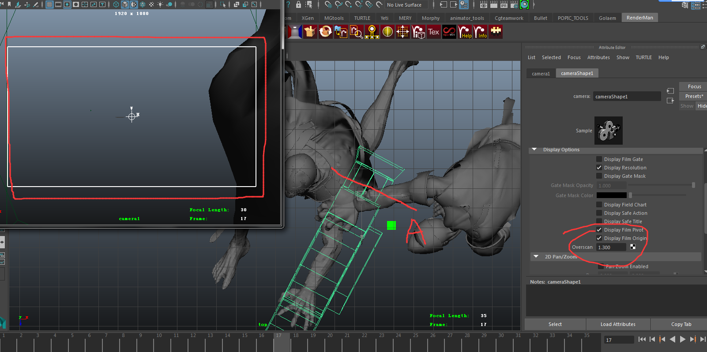
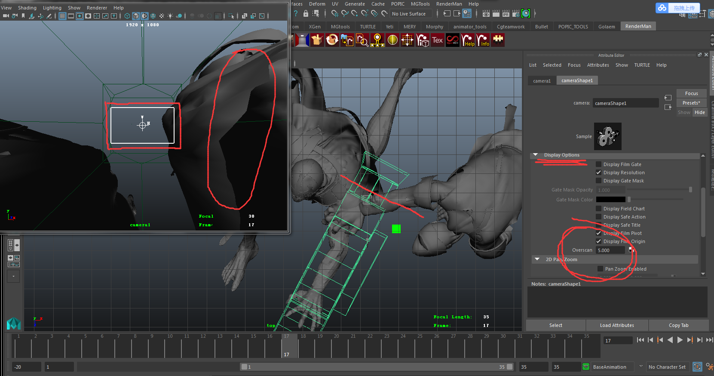

# 摄影机&拍屏操作

## 摄影机命名规范

不要使用标点符号命名摄影机，特别是中文输入法下的标点符号

如果真的有强迫症需要做一些区分，可以使用 字母大小写搭配 或 短下划线“\_” 来做区分

## 摄影机类型的选择

推荐使用“Camera”，其他两个摄影机感觉作用不大

## 拍屏设置与初步检查

### strokes检查

拍屏设置要勾选strokes，因为有些模型是用strokes制作的，这样方便检查模型的依附情况

## 注意画面外与镜头的穿插

maya摄影机的镜头部分要比实际显示的镜头画面要大，所以当模型靠近时，有可能出现镜头画面外出现穿插，但镜头画面内是不穿插的。 

这种镜头外的穿插虽然不影响画面效果，但会影响maya计算速度，比如后期渲染时异常地慢……

所以不仅要检查画面内与镜头有没有穿插，也要检查画面外

> 如何检查这种穿插？
>
> 一般尽量不要让模型太靠近摄影机，也可以调节摄影机的overscan参数，这样能查看更多画面外的部分。
>
> 比如拉吉尔这个镜头就是手臂的一部分在镜头画面外发生穿插了，可以调大摄影机的overscan参数，显示出更多镜头画面外的内容，从而发现问题~

